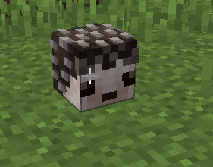

# skull\_value

Decorate yoru world with player heads with custom textures!

### Hedgehog

```yaml
# Example

skull_test:
  itemname: test
  material: player_head
  Components:
    skull_value: eyJ0ZXh0dXJlcyI6eyJTS0lOIjp7InVybCI6Imh0dHA6Ly90ZXh0dXJlcy5taW5lY3JhZnQubmV0L3RleHR1cmUvNWY1ZTgzNWMxMTZlOGUyMDBlMmUwNmFhNTkzY2FiOGYxYTlmOGM0MGU3ZjAwNWE5Yzc2ZjEyZTI0ZjRjNjM3MCJ9fX0=
```

<figure><figcaption><p>Result</p></figcaption></figure>
