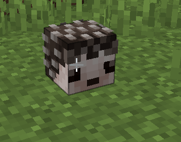

# skull\_value

Decorate your world with player heads with custom textures!

The item must use `material: PLAYER_HEAD`. `skull_value` accepts a Base64-encoded texture profile. The current version still loads this component; invalid texture values are reported in the server log and fall back to the default NexoAddon head texture.

### Hedgehog

```yaml
# Example

skull_test:
  itemname: test
  material: player_head
  Components:
    skull_value: eyJ0ZXh0dXJlcyI6eyJTS0lOIjp7InVybCI6Imh0dHA6Ly90ZXh0dXJlcy5taW5lY3JhZnQubmV0L3RleHR1cmUvNWY1ZTgzNWMxMTZlOGUyMDBlMmUwNmFhNTkzY2FiOGYxYTlmOGM0MGU3ZjAwNWE5Yzc2ZjEyZTI0ZjRjNjM3MCJ9fX0=
```

<figure><figcaption><p>Result</p></figcaption></figure>

To give the head a sound when placed above a note block, add [`note_block_sound`](note_block_sound.md) alongside `skull_value`.

`note_block_sound` also works with Nexo's `profile` component without `skull_value`. See [Using Nexo's profile component](note_block_sound.md#using-nexos-profile-component) for an example.
