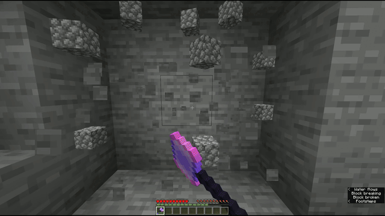

# BigMining

The BigMining mechanic allows players to break multiple blocks around a target block efficiently, respecting protection rules, unbreakable blocks, and player permissions.


`radius` and `depth` options are required!


### Simple

```yaml
# Example

Mechanics:
  bigmining:
    radius: 2         # The radius of blocks around the destroyed block to break.
    depth: 3          # The depth of blocks to break in the direction of mining.
```

### Switchable

```yaml
# Example

Mechanics:
  bigmining:
    radius: 1
    depth: 3
    switchable: true  # Will switch bigmining mode on right-click
```

<figure></figure>